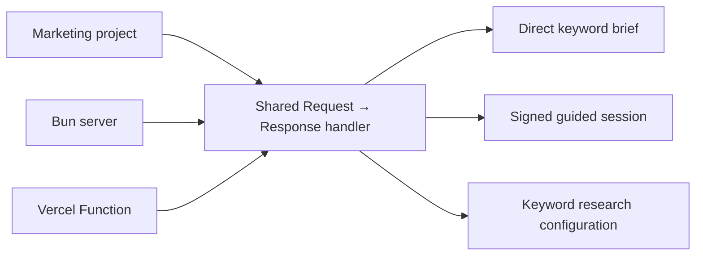

# Marketing Keyword Research

This project is the research companion to the separate blog-post-template repository. It exposes an API that accepts a marketing topic and returns researched, ranked keywords for planning blog posts. Blog-post templates, authors, personas, portraits, post profiles, and publishing workflows are intentionally out of scope.

## Keyword research workflow

1. Define the product, audience, market, and concrete problem.
2. Collect seed language from customers, support, sales, and product documentation.
3. Expand candidates with related questions, modifiers, and competitor terminology.
4. Classify intent and compare free Google Trends interest for promising candidates.
5. Select one primary query and supporting queries with distinct content jobs.
6. Record metrics, SERP observations, assumptions, content gaps, and a recommended angle.

The current MVP uses Google autocomplete and Google Trends as live, unauthenticated discovery sources. Trends provides normalized relative interest and direction, but not exact search volume, CPC, difficulty, or full SERP ranking data. Search Console is intentionally out of scope because this tool is not tied to a traffic-bearing website.

The output brief uses this shape:

```yaml
keyword_research:
  topic: "{{TOPIC}}"
  audience: "{{TARGET_AUDIENCE}}"
  primary_query: "{{PRIMARY_QUERY}}"
  supporting_queries: []
  search_intent: "informational"
  language: "English"
  country: "United States"
  trends_signal: "{{RELATIVE_INTEREST_AND_DIRECTION}}"
  serp_observations: "{{CURRENT_RESULT_PATTERNS_AND_CONTENT_GAP}}"
  recommended_content_angle: "{{UNIQUE_CONTENT_ANGLE}}"
```

## API architecture



The API keeps the copied repository’s portable local/Vercel setup, CORS handling, health route, discovery page, body-size limit, validation, and stateless HMAC-signed guided sessions. See [`docs/API.md`](docs/API.md) for usage.

## Development

```bash
bun test
bun run start
```
