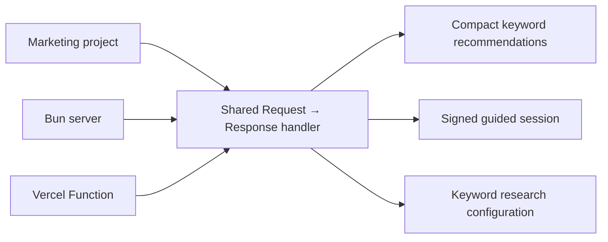

# Marketing Keyword Research API

This service researches keywords for marketing blog posts. An AI agent or another client sends a topic and optional language/country configuration. The API discovers related search language, adds free Google Trends signals internally, ranks the candidates, and returns a compact list of keyword recommendations.

Blog-post templates, authors, personas, portraits, post profiles, and publishing workflows belong to the separate reference project and are intentionally out of scope here.

## Keyword research workflow

1. Define the topic, audience, market, and preferred search intent.
2. Build intent-oriented seeds from the topic and audience.
3. Expand the seeds with related questions and marketing modifiers through Google Autocomplete.
4. Deduplicate candidates and classify their likely search intent.
5. Rank candidates using topic and audience relevance, seed coverage, intent match, and optional Google Trends signals.
6. Select one primary query and supporting queries with distinct content jobs for the blog post.

## What the MVP does

1. Builds research seeds from the topic, audience, and selected search intent.
2. Collects related queries from Google Autocomplete.
3. Deduplicates and classifies candidates by search intent.
4. Groups candidates into content-angle clusters such as costs, process, permits, plans, materials, financing, mistakes, energy, and maintenance.
5. Ranks validated candidates for topic relevance, audience relevance, seed coverage, and intent match, then selects supporting keywords from different clusters to avoid repetitive variants.
6. Adds Google Trends relative-interest and direction signals when available.
7. Returns only a primary keyword and diverse supporting keyword recommendations to the calling agent.

The pipeline is free and unauthenticated. It does not use Google Ads, paid keyword tools, or Search Console. Google Autocomplete and Google Trends provide useful directional signals, but they do not provide exact monthly search volume, CPC, paid competition, organic difficulty, or guaranteed ranking potential.

## Keyword score calculation

Each candidate receives a heuristic relevance score for prioritizing blog content. The score is not monthly search volume, CPC, competition, or a prediction of Google ranking position.

### What is included in the score

The score is a combination of signals, with Google Autocomplete as the candidate source:

1. Google Autocomplete supplies related keyword candidates from several topic- and intent-oriented seeds. Autocomplete does not provide a popularity score; it supplies the phrases that can be evaluated.
2. The API calculates a relevance score from topic matches, audience matches, search intent, seed coverage, exact topic matching, keyword specificity, and question phrasing.
3. Google Trends adds a secondary signal for the top candidates when available. It contributes normalized relative interest and a small rising-interest bonus.

Google Ads search volume, CPC, paid competition, Search Console data, and organic ranking difficulty are not included.

### What the number means

The score starts at `0`, but it does not have a fixed maximum such as `100`. It is a relative priority number: a keyword with a higher score is a stronger candidate than one with a lower score in the same research response. Scores from different topics, markets, languages, or research dates should not be compared directly.

As a practical interpretation:

| Score | Meaning |
|---:|---|
| `0` | No supporting research evidence; the API used the supplied topic as a fallback. |
| `1–10` | Really weak keyword; limited relevance or evidence. |
| `11–20` | Okay-ish/relevant keyword with a reasonable content opportunity. |
| `21–30` | Good keyword that closely matches the topic and intent. |
| `31+` | Really good keyword within that particular research response; this is not a percentage. |

These bands are guidelines, not hard grades. The score can be an integer when it uses only the keyword-matching formula, or a decimal when Google Trends adds a relative-interest signal.

In the browser dashboard, the score is visualized with a colored progress bar over a gray track using `50` as the display scale. A score of `25` fills the bar to 50%; a score of `50` or higher fills it completely. The actual score number is shown beside the bar. This is only a visual cap—the API continues to return the original score value.

The fill color also follows the visual score: red for 0–19%, orange for 20–39%, yellow for 40–59%, yellow-green for 60–79%, and green for 80–100% of the 0–50 display scale.

The base score is calculated as:

```text
base score =
  topic-word matches × 5
  + audience-word matches × 2
  + number of research seeds containing the keyword × 3
  + 4 when the keyword matches the selected search intent
  + 6 when the keyword exactly matches the supplied topic
  + specificity bonus from 0 to 3 for additional meaningful words
  + content-angle usefulness bonus from 0 to 4
  + 1 when the keyword is a question
```

When Google Trends returns a signal, its additional trend score is added to the base score. The trend score is based on normalized relative interest over the configured timeframe, with a small bonus when interest is rising. This makes the score useful for comparing the returned candidates within one research request, but it should not be compared across unrelated topics, languages, countries, or time periods.

The primary keyword usually receives the exact-topic bonus. Supporting keywords can still score highly when they are strongly related, appear across multiple research seeds, match the selected intent, or add useful specificity. If no direct candidate is available at all, the API falls back to the supplied topic with score `0`. Exploratory seeds and provider evidence remain internal and are not returned to the calling agent.

The compact response uses this shape:

```json
{
  "topic": "Rodinné domy",
  "primary_keyword": { "keyword": "rodinné domy", "score": 23 },
  "supporting_keywords": [
    { "keyword": "rodinné domy na prodej", "score": 19 }
  ]
}
```

## API architecture



The API keeps the portable local/Vercel setup from the reference repository: a shared Request → Response handler, CORS handling, health route, discovery response, browser dashboard, body-size limit, validation, and stateless HMAC-signed guided sessions. See [`docs/API.md`](docs/API.md) for the complete API reference.

The root URL serves a browser dashboard. It shows the human-readable primary and supporting keyword bubbles first, followed by the compact agent-ready JSON response.

## Main endpoints

| Method | Path | Purpose |
|---|---|---|
| `GET` | `/` | Browser dashboard, or JSON endpoint discovery for non-HTML clients. |
| `GET` | `/health` | Health check. |
| `GET` | `/v1/config` | Current defaults and limits. |
| `POST` | `/v1/keywords/recommended` | Research a topic using the default configuration. |
| `POST` | `/v1/keywords/research` | Alias for the recommended route. |
| `POST` | `/v1/keywords/specific` | Research with configuration overrides. |
| `POST` | `/v1/sessions` | Start the optional guided setup flow. |
| `POST` | `/v1/sessions/answers` | Answer the next guided setup question. |

### Recommended request

```bash
curl -X POST http://127.0.0.1:3000/v1/keywords/recommended \
  -H 'Content-Type: application/json' \
  -d '{"topic":"Rodinné domy","configuration":{"language":"Czech","country":"Czech Republic"}}'
```

The response contains `topic`, `primary_keyword`, and ranked `supporting_keywords`. Provider details, internal research traces, and methodology are kept inside the API.

### Configure language and country

The default market is Czech/Czech Republic. Clients can override it per request:

```bash
curl -X POST http://127.0.0.1:3000/v1/keywords/specific \
  -H 'Content-Type: application/json' \
  -d '{
    "topic":"inventory software",
    "configuration":{
      "language":"German",
      "country":"Germany",
      "search_intent":"commercial",
      "supporting_query_limit":6
    }
  }'
```

Supported search intents are `informational`, `commercial`, `transactional`, and `navigational`. Other configuration values and unknown configuration keys return HTTP `422`; malformed JSON returns HTTP `400`.

## Development

```bash
bun test
bun run start
```

The local server listens on `http://127.0.0.1:3000`. If that port is busy, it tries the next ten ports. Set `PORT` or `HOST` to choose a specific binding. Open the root URL in a browser to use the dashboard.

Guided sessions require a `SESSION_SECRET` environment variable with at least 32 characters. Direct keyword research does not require credentials.

## Deployment

The project is deployed on Vercel through the connected `promotemyapp/keywords` GitHub repository. The production deployment is available at [keywords-lemon.vercel.app](https://keywords-lemon.vercel.app). `vercel.json` and the `api/` entrypoints keep the deployment compatible with the local handler.

Push changes to the connected deployment branch to create a new Vercel deployment. Configure `SESSION_SECRET` in Vercel only if the guided session endpoints are needed.
