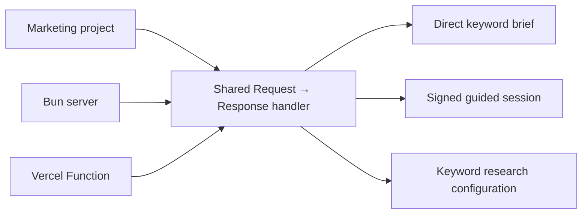

# Marketing Keyword Research API

This service researches keywords for marketing blog posts. An AI agent or another client sends a topic, optional audience, and optional market configuration. The API discovers related search language, adds free Google Trends signals, ranks the candidates, and returns a structured content brief.

Blog-post templates, authors, personas, portraits, post profiles, and publishing workflows belong to the separate reference project and are intentionally out of scope here.

## Keyword research workflow

1. Define the topic, audience, market, and preferred search intent.
2. Build intent-oriented seeds from the topic and audience.
3. Expand the seeds with related questions and marketing modifiers through Google Autocomplete.
4. Deduplicate candidates and classify their likely search intent.
5. Rank candidates using topic and audience relevance, seed coverage, intent match, and optional Google Trends signals.
6. Select one primary query and supporting queries with distinct content jobs for the blog post.

## What the MVP does

1. Builds research seeds from the topic, audience, and selected search intent.
2. Collects related queries from Google Autocomplete.
3. Deduplicates and classifies candidates by search intent.
4. Ranks candidates for topic relevance, audience relevance, seed coverage, and intent match.
5. Adds Google Trends relative-interest and direction signals when available.
6. Returns a primary keyword, supporting keywords, methodology, limitations, sources, and a YAML brief for a blog-writing agent.

The pipeline is free and unauthenticated. It does not use Google Ads, paid keyword tools, or Search Console. Google Autocomplete and Google Trends provide useful directional signals, but they do not provide exact monthly search volume, CPC, paid competition, organic difficulty, or guaranteed ranking potential.

The output brief uses this shape:

```yaml
keyword_research:
  topic: "{{TOPIC}}"
  audience: "{{TARGET_AUDIENCE}}"
  primary_query: "{{PRIMARY_QUERY}}"
  supporting_queries: []
  search_intent: "informational"
  language: "Czech"
  country: "Czech Republic"
  trends_signal: "{{RELATIVE_INTEREST_AND_DIRECTION}}"
  serp_observations: "{{CURRENT_RESULT_PATTERNS_AND_CONTENT_GAP}}"
  recommended_content_angle: "{{UNIQUE_CONTENT_ANGLE}}"
```

## API architecture



The API keeps the portable local/Vercel setup from the reference repository: a shared Request → Response handler, CORS handling, health route, discovery response, browser dashboard, body-size limit, validation, and stateless HMAC-signed guided sessions. See [`docs/API.md`](docs/API.md) for the complete API reference.

The root URL serves a browser dashboard. It shows the human-readable primary and supporting keyword bubbles first, followed by the full agent-ready JSON response, YAML brief, and research guidance.

## Main endpoints

| Method | Path | Purpose |
|---|---|---|
| `GET` | `/` | Browser dashboard, or JSON endpoint discovery for non-HTML clients. |
| `GET` | `/health` | Health check. |
| `GET` | `/v1/config` | Current defaults and limits. |
| `POST` | `/v1/keywords/recommended` | Research a topic using the default configuration. |
| `POST` | `/v1/keywords/research` | Alias for the recommended route. |
| `POST` | `/v1/keywords/specific` | Research with configuration overrides. |
| `POST` | `/v1/sessions` | Start the optional guided setup flow. |
| `POST` | `/v1/sessions/answers` | Answer the next guided setup question. |

### Recommended request

```bash
curl -X POST http://127.0.0.1:3000/v1/keywords/recommended \
  -H 'Content-Type: application/json' \
  -d '{"topic":"Rodinné domy","audience":"rodiny plánující nový dům"}'
```

The response contains `research.primary_keyword`, ranked `research.supporting_keywords`, `research.all_candidates`, Trends signals, source URLs, limitations, and `brief.markdown`.

### Configure language and country

The default market is Czech/Czech Republic. Clients can override it per request:

```bash
curl -X POST http://127.0.0.1:3000/v1/keywords/specific \
  -H 'Content-Type: application/json' \
  -d '{
    "topic":"inventory software",
    "audience":"independent retailers",
    "configuration":{
      "language":"German",
      "country":"Germany",
      "search_intent":"commercial",
      "supporting_query_limit":6
    }
  }'
```

Supported search intents are `informational`, `commercial`, `transactional`, and `navigational`. Other configuration values and unknown configuration keys return HTTP `422`; malformed JSON returns HTTP `400`.

## Development

```bash
bun test
bun run start
```

The local server listens on `http://127.0.0.1:3000`. If that port is busy, it tries the next ten ports. Set `PORT` or `HOST` to choose a specific binding. Open the root URL in a browser to use the dashboard.

Guided sessions require a `SESSION_SECRET` environment variable with at least 32 characters. Direct keyword research does not require credentials.

## Deployment

The project is deployed on Vercel through the connected `promotemyapp/keywords` GitHub repository. The production deployment is available at [keywords-lemon.vercel.app](https://keywords-lemon.vercel.app). `vercel.json` and the `api/` entrypoints keep the deployment compatible with the local handler.

Push changes to the connected deployment branch to create a new Vercel deployment. Configure `SESSION_SECRET` in Vercel only if the guided session endpoints are needed.
